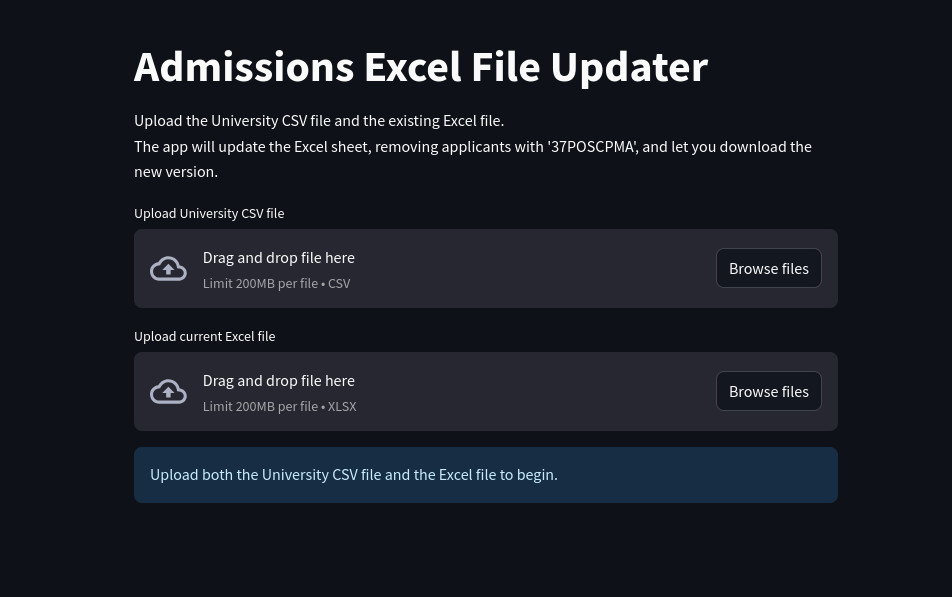

# Admissions Excel File Updater

A simple Streamlit app to update and synchronize MPA applicant data.  
Upload your latest university CSV and your master Excel sheet—this app merges changes, excludes certain applicants, and provides a ready-to-download updated Excel file.  
**No coding required!**

---

## Features

- Drag-and-drop interface
- Merges new admissions data with your master Excel file
- Excludes applicants with `'37POSCPMA'` in `acad_plan`
- Updates changed records and adds new applicants
- Runs locally on Mac or Windows (no data leaves your computer)

---

## Getting Started

### 1. Install Prerequisites

- Ensure Python 3.8+ is installed ([Download Python](https://www.python.org/downloads/))
- Install dependencies:

    ```bash
    pip install -r requirements.txt
    ```

### 2. Launch the App

Run in Terminal:

```bash
streamlit run admissions_app.py
```

A browser window will open with the app.

## App Screenshot



### 3. Upload Your Files

- **University CSV file:** Latest admissions export
- **Current Excel file:** Your master applicant sheet

The app processes your files and provides a download link for the updated Excel file.

---

## Tips

- If the Excel file does not exist yet, create it with at least an `id` column.
- Both files should include an `id` field to match records.
- The output file is fully compatible with Excel.

---

## File Structure

```
admissions-excel-updater/
│
├── admissions_app.py
├── requirements.txt
├── admissions_app.png
├── README.md
├── LICENSE
├── .gitignore
└── Run Admissions App.command  # Optional Mac launcher
```

---

## For Developers

- To create a double-clickable launcher on Mac, use the included `Run Admissions App.command` script (make it executable with `chmod +x`).

---

## License

MIT License (see LICENSE file for details).

---

## Quick Setup Checklist

1. Place all files as listed above in your project folder.
2. Add your latest `admissions_app.py`.
3. Push to GitHub as usual.

